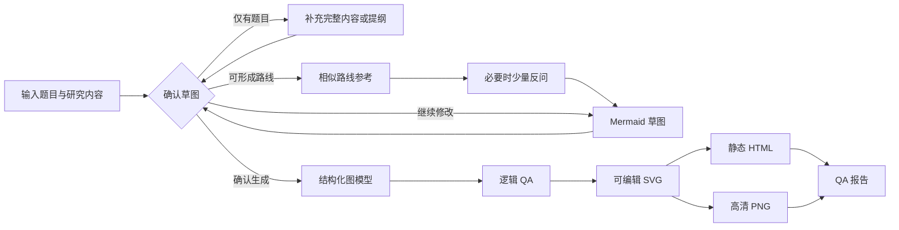

# Research Route Map

Research Route Map 是一个把既有研究内容或结构化研究提纲转换为科研技术路线图的 Codex Skill。它适合论文开题、基金申请、课题论证和团队项目规划。Skill 不会仅凭一个题目替研究者编写完整设计，而是先检查研究内容是否足以形成路线，再生成清晰、可确认、可交付的技术路线图。

这个 Skill 的默认理解是“科研研究流程路线图”：从问题提出出发，组织研究任务、方法数据、验证指标和预期成果。对于真正带时间轴和里程碑的技术发展规划，也可以切换为技术路线图模式。

## What It Does

- 从完整研究内容或提纲中提取研究思路、具体任务、方法数据、指标验证和阶段产出。
- 研究内容不足时先提示补充；只有题目时不会直接生成草图。
- 轻量检索相似路线，用于检查结构遗漏、方法分叉和验证方式，不覆盖用户设计。
- 仅针对会改变路线的缺口提出问题，总数不超过5个；详细材料完整时可以0次反问。
- 先生成 Mermaid 草图，让用户直接确认或对话修改研究逻辑。
- 默认使用快速制图模式；需要完整来源追溯时可切换为严谨研究模式。
- 在确认后生成可编辑 SVG、静态 HTML 和高清 PNG；QA 报告保留在内部。
- 新版研究流程图固定使用“研究思路 / 研究内容与阶段输出 / 研究方法”三列。
- 具体数据、模型、变量、指标和检验放在研究内容列；右栏只汇总研究方法类别。
- 对包含多个子项的节点使用树形结构，提升层级表达和可读性。
- 新增“核心问题—文献空白—实证设计”逻辑层，避免把变量、模型和检验压缩成模板化阶段卡片。
- 全流程使用直线或 90 度正交折线，不使用曲线连线。

## Core Framework

Research Route Map 由四个核心层组成：

| 层级 | 作用 |
|---|---|
| 研究定位 | 明确研究身份、用途、对象、问题边界和资源条件 |
| 路线草图 | 用 Mermaid 表达思路、内容、方法、产出和关键依赖，作为用户确认门 |
| 图模型 | 将确认后的草图转为结构化节点、边、证据和版式规格 |
| 同源交付 | 输出可编辑 SVG、离线 HTML、高清 PNG；QA 报告保留在内部 |

典型流程如下：



Mermaid 草图是唯一的用户确认门。用户可以直接说“把 S2 的方法改为案例比较”“删除 S4”“把 S3 拆成并行任务”。每次修改后都会重新输出完整草图，并保持未受影响的节点 ID 稳定。

确认后可选择两种生成模式：

- `fast`（默认）：复用用户提供的研究内容和已核验的相似路线依据，不重复进行完整深度检索，适合日常论文、开题和方案讨论。
- `rigorous`：继续进行节点级证据深化和来源追溯，适合基金申请、博士课题、正式评审和高风险研究。

两种模式使用同样的研究逻辑、版式、SVG/HTML/PNG 同源规则和视觉 QA。区别只在证据深化深度，不在图形质量标准。

## Route Modes

| 模式 | 适用场景 | 常见内容 |
|---|---|---|
| `research-process` | 论文、开题、基金申请中的科研流程 | 问题、阶段任务、方法数据、验证、产出 |
| `research-framework` | 理论框架、指标框架或概念关系 | 理论、变量、指标、机制和关系 |
| `technology-roadmap` | 带时间轴的技术发展规划 | 能力目标、里程碑、KPI、风险和决策门 |
| `study-flow` | 样本、参与者或文献记录流转 | 纳入、排除、分组、处理、随访或分析 |

默认使用 `research-process`。如果用户明确提出技术成熟度、时间轴、能力缺口或里程碑，Skill 会更适合使用 `technology-roadmap`。

## Academic Calibration

Skill 会根据研究层级调整路线深度，但不会替用户编造不可获得的方法或数据。

| 层级 | 默认复杂度 |
|---|---|
| 本科 | 3 个左右阶段，单一主方法，基础比较或验证 |
| 硕士 | 3-4 个阶段，主方法加对比或稳健性验证，突出一个创新点 |
| 博士 | 4-5 个阶段，强调理论、机制或方法创新，可包含外部验证 |
| 教授/团队 | 4-5 个工作包，强调并行任务、依赖关系、风险和资源配置 |

用户已经确定的研究设计始终优先；学术层级只用于控制图的复杂度和验证深度。

## Layout Style

最终图先生成独立、可编辑的 SVG，再将完全相同的 SVG 嵌入 HTML 并导出 PNG。新版研究流程图默认使用自适应列布局：

- 固定显示“研究思路 / 研究内容与阶段输出 / 研究方法”三列，不再额外显示“研究阶段”。
- 左侧研究思路使用2–6个字的短语，例如“理论构建、风险识别、机制检验”。
- 表头与下方内容列严格对齐。
- 阶段高度由该行真实内容决定，避免大块空白。
- 研究内容标题只放在“研究内容与阶段输出”列顶部。
- FO法、具体数据集、模型、变量、指标、阈值和稳健性检验放在中栏。
- 右栏只显示文献分析法、调查研究法、计量分析法、案例分析法等汇总方法名称。
- 2-4 个子项默认绘制为“父框-正交母线-子框”的树形结构。

连线遵循科研图的可读性原则：主流程使用实线；可选、假设或待验证关系可以使用带文字说明的虚线；所有连线只使用直线或 90 度折线。

## Deliverables

| 文件 | 内容 |
|---|---|
| `route-map.svg` | 可在 WPS、PowerPoint、Illustrator、Inkscape 或 Figma 中继续编辑 |
| `route-map.html` | 自包含静态 HTML，内嵌可访问 SVG |
| `route-map.png` | 与 SVG 同源的高清 PNG，写入 300 dpi |
| `qa-report.json` | 内部质量检查；用户需要时再提供 |

SVG 保留真实文字、节点、连线和语义分组，不把文字转成轮廓路径。为了提高 Office/WPS 兼容性，图中只使用基础 SVG 图元，箭头由独立连线和三角形组成，不依赖脚本、外链、滤镜或 marker。

在 WPS 或 PowerPoint 中可将 SVG 作为清晰的矢量图形插入、缩放和调整样式；是否能转换或拆分为单个形状取决于软件版本。在 Illustrator、Inkscape 或 Figma 中，可按稳定分组直接修改节点、文字、连线和颜色。

默认交付仅包含 `route-map.html`、`route-map.svg` 和 `route-map.png`。内部仍会维护逻辑 QA 报告、问答档案、相似路线依据、草图修订、图模型和哈希锁，用于保证最终图与用户确认过的研究逻辑一致。

## Installation

Clone this repository into the Codex skills directory:

```bash
git clone https://github.com/yz20211314/research-route-map.git \
  "${CODEX_HOME:-$HOME/.codex}/skills/research-route-map"
```

Restart Codex or reload skills after installation.

Optional rendering dependencies:

```bash
cd "${CODEX_HOME:-$HOME/.codex}/skills/research-route-map"
npm install
npx playwright install chromium
```

The core scripts use Node.js. Browser-based PNG export and visual QA use Playwright when available; SVG rasterization can fall back to Sharp.

## Usage Examples

```text
使用 $research-route-map 把我提供的硕士论文研究内容转换为技术路线图。
先检查内容完整性，只反问会改变路线的问题，再给 Mermaid 草图确认。
```

```text
把 S2 的数据来源改成自采配对数据。
把 S3 拆成模型构建和消融实验两个并行任务。
确认草图，按此生成。
```

如果需要完整证据追溯，可以明确指定：

```text
按严谨研究模式生成，补充节点级来源、验证依据和完整 QA 报告。
```

## Quality Checks

The QA pipeline checks:

- text overflow and minimum font size;
- node overlap and edge routing;
- straight or orthogonal-only connector paths;
- header-to-column alignment;
- tree layout bounds;
- contrast and grayscale readability;
- editable SVG structure and Office-safe primitives;
- SVG, HTML and PNG consistency;
- alt text, long description and reading order.

Run the local test suite with:

```bash
npm test
```

已有草稿锁和规格锁的项目可以用一次命令完成最终构建：

```bash
node scripts/build-route.mjs <project> --mode fast --delivery-dir <output-dir>
```

构建命令会先运行 `validate-spec`、`validate-logic` 和完整视觉 QA，并只将 HTML、SVG 和 PNG 复制到交付目录。

## Project Structure

```text
research-route-map/
├── SKILL.md
├── agents/openai.yaml
├── assets/templates/
├── references/
├── scripts/
├── README.md
└── LICENSE
```

See [`references/`](references/) for schema definitions, route standards, visual language and domain checks.

## License

Licensed under the [Apache License 2.0](LICENSE).
