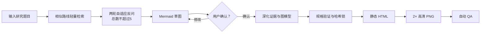

# Research Route Map

面向科研论文、基金申请和团队项目的 Codex Skill。它不会只根据一个题目自动编造完整技术路线，而是先参考相似研究提出少量关键问题，再通过 Mermaid 草图与用户确认研究逻辑，最终生成静态 HTML、高清 PNG 和自动 QA 报告。

## 核心特点

- 先调研、后反问：轻量检索 2–3 条相似研究路线，第一轮询问 3 个核心问题，必要时再追问最多 2 个问题。
- Mermaid 确认门：用不超过 10 个节点的紧凑草图确认阶段、方法和产出，支持通过自然语言持续修改。
- 学术层级校准：根据本科、硕士、博士、教授/团队项目调整阶段数量、方法复杂度和验证深度。
- 四类路线模式：研究流程、研究框架、技术发展路线图和研究对象流转图。
- 自适应静态排版：动态生成可见列，每个表头对应每个阶段的独立单元格，阶段高度由真实内容决定。
- 树形子项：包含 2–4 个子项时默认使用父节点、正交母线和独立子框。
- 正交连线：所有流程线、支撑线和树线仅使用直线或 90° 折线，不使用贝塞尔曲线。
- 单一渲染源：HTML 内嵌 SVG，PNG 从同一份 SVG 数据生成，避免两套渲染结果不一致。
- 自动质量检查：检测文字裁切、节点重叠、边穿节点、列错位、曲线、低对比度、PNG 尺寸和无障碍信息。

## 工作流程



只有用户明确说“确认草图”或“按此生成”后，Skill 才会进入最终建图。若后续证据会改变阶段、方法或主流程，必须退回草图重新确认。

## 路线模式

| 模式 | 适用场景 | 主要结构 |
|---|---|---|
| `research-process` | 默认科研技术路线图 | 问题、任务、方法/数据、验证、阶段产出 |
| `research-framework` | 理论或变量关系框架 | 理论、问题、方法、指标的并列或关系结构 |
| `technology-roadmap` | 真正的技术发展路线 | 时间轴、能力缺口、KPI、里程碑、风险和决策门 |
| `study-flow` | 样本、参与者或文献流转 | 纳入、排除、分配、随访或记录流转 |

## 安装

### 1. 克隆到 Codex Skills 目录

```bash
git clone https://github.com/yz20211314/research-route-map.git \
  "${CODEX_HOME:-$HOME/.codex}/skills/research-route-map"
```

重启 Codex 或重新加载 Skills 后即可使用。

### 2. 安装可选渲染依赖

脚本主体只依赖 Node.js 内置模块。PNG 导出和浏览器级 QA 需要 Playwright 或 Sharp：

```bash
cd "${CODEX_HOME:-$HOME/.codex}/skills/research-route-map"
npm install
npx playwright install chromium
```

如果系统已安装 Chrome、Chromium 或 Edge，导出脚本会优先复用系统浏览器；浏览器不可用时会尝试使用 Sharp 从内嵌 SVG 栅格化。

## 使用示例

```text
使用 $research-route-map 为“面向交通标志识别的暗光图像预处理研究”
制定硕士论文技术路线。先反问我必要信息，再给 Mermaid 草图确认。
```

也可以直接对草图提出修改：

```text
把 S2 的数据来源改成自采配对数据。
把 S3 拆成模型构建和消融实验两个并行任务。
删除高成本的外部设备实验。
确认草图，按此生成。
```

## 最终交付物

| 文件 | 内容 |
|---|---|
| `route-map.html` | 自包含静态 HTML，内嵌可访问 SVG |
| `route-map.png` | 与 SVG 同源的 2× 高清 PNG，写入 300 dpi |
| `qa-report.json` | 几何、字体、连线、对比度、尺寸及一致性检查 |

新项目还会在内部维护问答、相似路线、草图修订和哈希锁文件，但不会用长篇 Markdown 干扰用户确认。

## 自适应版式

新的 `research-process` 项目默认使用 design schema 1.3：

- 先尝试 1240 px 宽，空间不足时切换为 1754 px；
- 高度根据标题、表头、阶段内容、成果区和图例自动裁切；
- 有几个可见表头，就为每个阶段生成几个独立单元格；
- 即使某阶段在某个全局可见列中没有节点，也保留空单元格；
- 阶段标题只显示在“研究内容与阶段输出”单元格顶部；
- “研究思路”和“研究内容”不会合并成跨列表面容器；
- 每个阶段所有单元格与左侧阶段多边形共享相同的 `y/height`。

旧 schema 1.0–1.2 项目继续使用原有显式定位和固定 A4 兼容流程。

## 运行测试

需要 Node.js 20 或更高版本。

```bash
npm test
```

也可以分别运行：

```bash
npm run test:draft
npm run test:stages
npm run test:static
```

测试覆盖：

- 本科、硕士、博士、教授/团队等问答路径；
- 3–6 阶段自适应布局；
- 四种路线模式和三种方法栏模式；
- 动态隐藏、增加列以及每阶段独立单元格；
- 2–4 子项树形布局；
- 直线、折线、方法母线和障碍绕行；
- schema 1.0/1.1/1.2 兼容；
- HTML/PNG 同源、300 dpi、窄屏和无障碍 QA；
- 对曲线、列错位、无语义虚线、节点重叠和文字裁切的拒绝测试。

## 项目结构

```text
research-route-map/
├── SKILL.md                 # Skill 主流程与强制规则
├── agents/openai.yaml       # Codex 展示与默认提示
├── assets/templates/        # 问答、检索和 Mermaid 草图模板
├── references/              # schema、视觉语言、领域检查及标准依据
└── scripts/                 # 验证、锁定、渲染、导出、QA 与测试
```

## 设计边界

- 不开发或交付自由拖拽编辑器；草图修改通过与 AI 对话完成。
- 相似路线只用于提出更准确的问题和参考结构，不替用户决定研究方法。
- 学术层级只控制复杂度，不会覆盖用户明确给出的研究设计。
- 领域规范用于适用性检查，不替代研究设计或科学证据。
- 主流程使用实线；虚线只表达有文字或状态说明的可选、不确定关系。

更完整的输入输出 schema、制图规范和规则来源见 [`references/`](references/)。
