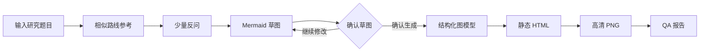

# Research Route Map

Research Route Map 是一个用于生成科研技术路线图的 Codex Skill。它适合论文开题、基金申请、课题论证和团队项目规划，重点不是把题目直接扩写成一张复杂大图，而是先帮助研究者厘清研究问题、方法条件、阶段产出和验证路径，再生成清晰、可确认、可交付的技术路线图。

这个 Skill 的默认理解是“科研研究流程路线图”：从问题提出出发，组织研究任务、方法数据、验证指标和预期成果。对于真正带时间轴和里程碑的技术发展规划，也可以切换为技术路线图模式。

## What It Does

- 根据研究题目轻量检索相似路线，提炼常见阶段、方法分叉和验证方式。
- 通过最多 5 个问题收集关键信息，适配本科、硕士、博士、基金或团队项目的不同复杂度。
- 先生成 Mermaid 草图，让用户直接确认或对话修改研究逻辑。
- 在确认后生成静态 HTML、高清 PNG 和 QA 报告。
- 使用自适应列布局，让研究阶段、研究思路、研究内容、方法数据等区域一一对应。
- 对包含多个子项的节点使用树形结构，提升层级表达和可读性。
- 全流程使用直线或 90 度正交折线，不使用曲线连线。

## Core Framework

Research Route Map 由四个核心层组成：

| 层级 | 作用 |
|---|---|
| 研究定位 | 明确研究身份、用途、对象、问题边界和资源条件 |
| 路线草图 | 用 Mermaid 表达阶段、方法、产出和关键依赖，作为用户确认门 |
| 图模型 | 将确认后的草图转为结构化节点、边、证据和版式规格 |
| 静态交付 | 输出可离线查看的 HTML、高清 PNG 和自动 QA 报告 |

典型流程如下：



Mermaid 草图是唯一的用户确认门。用户可以直接说“把 S2 的方法改为案例比较”“删除 S4”“把 S3 拆成并行任务”。每次修改后都会重新输出完整草图，并保持未受影响的节点 ID 稳定。

## Route Modes

| 模式 | 适用场景 | 常见内容 |
|---|---|---|
| `research-process` | 论文、开题、基金申请中的科研流程 | 问题、阶段任务、方法数据、验证、产出 |
| `research-framework` | 理论框架、指标框架或概念关系 | 理论、变量、指标、机制和关系 |
| `technology-roadmap` | 带时间轴的技术发展规划 | 能力目标、里程碑、KPI、风险和决策门 |
| `study-flow` | 样本、参与者或文献记录流转 | 纳入、排除、分组、处理、随访或分析 |

默认使用 `research-process`。如果用户明确提出技术成熟度、时间轴、能力缺口或里程碑，Skill 会更适合使用 `technology-roadmap`。

## Academic Calibration

Skill 会根据研究层级调整路线深度，但不会替用户编造不可获得的方法或数据。

| 层级 | 默认复杂度 |
|---|---|
| 本科 | 3 个左右阶段，单一主方法，基础比较或验证 |
| 硕士 | 3-4 个阶段，主方法加对比或稳健性验证，突出一个创新点 |
| 博士 | 4-5 个阶段，强调理论、机制或方法创新，可包含外部验证 |
| 教授/团队 | 4-5 个工作包，强调并行任务、依赖关系、风险和资源配置 |

用户已经确定的研究设计始终优先；学术层级只用于控制图的复杂度和验证深度。

## Layout Style

最终图采用静态 SVG 渲染，并导出为 HTML 和 PNG。新版研究流程图默认使用自适应列布局：

- 有几个可见表头，就为每个阶段生成几个独立单元格。
- 表头与下方内容列严格对齐。
- 阶段高度由该行真实内容决定，避免大块空白。
- 阶段标题只放在“研究内容与阶段输出”列顶部。
- 研究思路、研究内容、方法数据和自定义 lane 分别绘制在独立列中。
- 2-4 个子项默认绘制为“父框-正交母线-子框”的树形结构。

连线遵循科研图的可读性原则：主流程使用实线；可选、假设或待验证关系可以使用带文字说明的虚线；所有连线只使用直线或 90 度折线。

## Deliverables

| 文件 | 内容 |
|---|---|
| `route-map.html` | 自包含静态 HTML，内嵌可访问 SVG |
| `route-map.png` | 与 HTML 同源的高清 PNG，写入 300 dpi |
| `qa-report.json` | 字号、溢出、重叠、连线、对比度和尺寸一致性检查 |

内部还会维护问答档案、相似路线依据、草图修订和哈希锁，用于保证最终图与用户确认过的研究逻辑一致。

## Installation

Clone this repository into the Codex skills directory:

```bash
git clone https://github.com/yz20211314/research-route-map.git \
  "${CODEX_HOME:-$HOME/.codex}/skills/research-route-map"
```

Restart Codex or reload skills after installation.

Optional rendering dependencies:

```bash
cd "${CODEX_HOME:-$HOME/.codex}/skills/research-route-map"
npm install
npx playwright install chromium
```

The core scripts use Node.js. Browser-based PNG export and visual QA use Playwright when available; SVG rasterization can fall back to Sharp.

## Usage Examples

```text
使用 $research-route-map 为“面向交通标志识别的暗光图像预处理研究”
制定硕士论文技术路线。先反问我必要信息，再给 Mermaid 草图确认。
```

```text
把 S2 的数据来源改成自采配对数据。
把 S3 拆成模型构建和消融实验两个并行任务。
确认草图，按此生成。
```

## Quality Checks

The QA pipeline checks:

- text overflow and minimum font size;
- node overlap and edge routing;
- straight or orthogonal-only connector paths;
- header-to-column alignment;
- tree layout bounds;
- contrast and grayscale readability;
- HTML and PNG consistency;
- alt text, long description and reading order.

Run the local test suite with:

```bash
npm test
```

## Project Structure

```text
research-route-map/
├── SKILL.md
├── agents/openai.yaml
├── assets/templates/
├── references/
├── scripts/
├── README.md
└── LICENSE
```

See [`references/`](references/) for schema definitions, route standards, visual language and domain checks.

## License

Licensed under the [Apache License 2.0](LICENSE).
