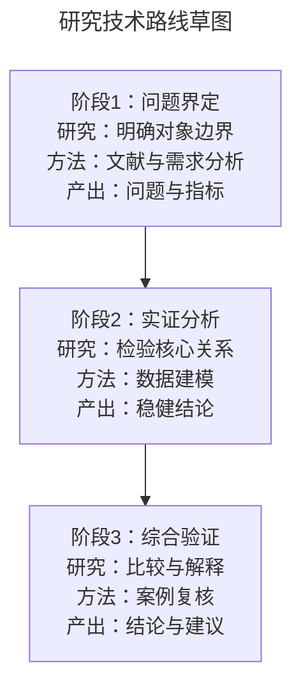

# Mermaid confirmation draft

`route_draft.mmd` is the only user-facing confirmation artifact for new projects. It is a compact route contract, not the final diagram and not a literature review.

## Canonical form

Requirements:

- keep `curve: stepAfter`; do not use an init directive or another curve;
- use `flowchart TD` by default and `flowchart LR` only when the route is materially clearer in landscape;
- use stable visible-node IDs: `S1…` for stages/work packages, `D1…` for real decisions, `O1…` for separately visible outcomes, and `P1…` for support/parallel items;
- use 3–5 `S` nodes by default; six needs the intake density exception;
- keep the entire draft at no more than 10 visible nodes;
- a stage card has at most four ` `-separated lines: stage, research content, method/data, output;
- target no more than 14 CJK-equivalent characters per line; shorten wording instead of shrinking type;
- use `{...}` only for `D` decision nodes and only when a genuine branch exists;
- use solid `-->` for the main route;
- use dashed `-.->|可选：…|` or `-.->|待验证：…|` only for optional, uncertain support, or parallel relations;
- never use `click`, external links, remote images, HTML scripts, or interactive callbacks.

Every draft carries `%% revision: N`, and `N` must equal `intake_profile.json.draft_revision`.

## Revision contract

When the user asks to change the draft:

1. preserve unaffected node IDs;
2. increment `draft_revision`;
3. rewrite the complete Mermaid file;
4. treat every existing `draft_lock.json` and downstream lock as stale;
5. display the complete revised diagram and at most three change summaries.

Do not lock from a partial patch or an old revision.

## User-facing response

The confirmation message contains only:

1. the complete Mermaid diagram;
2. at most five one-sentence notes covering research positioning, key assumptions, and pending items;
3. one short editing hint, such as “可以直接说：把 S3 的方法改为案例比较。”

Do not expose the complete evidence table, node provenance, or machine files unless the user asks. Continue only after explicit wording such as “确认草图” or “按此生成”.
